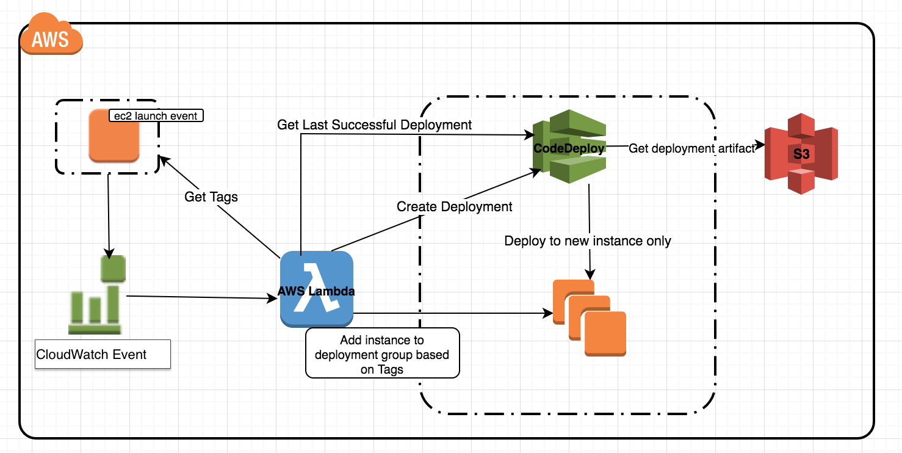
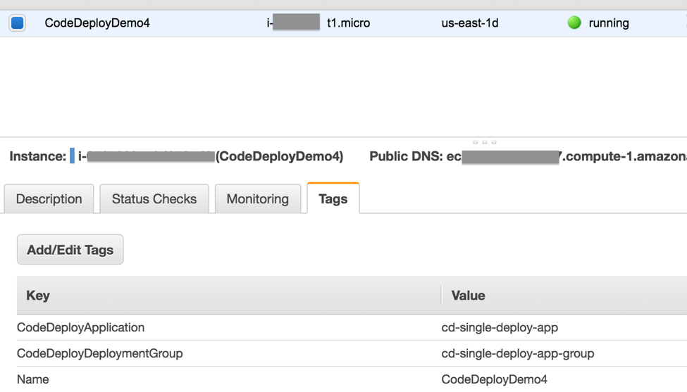
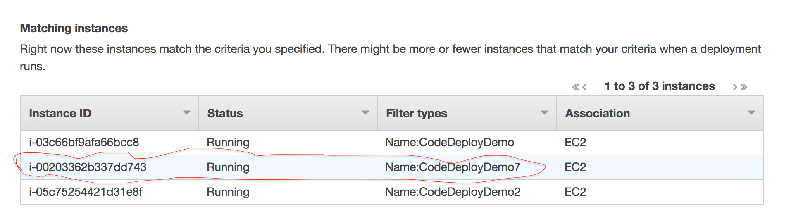
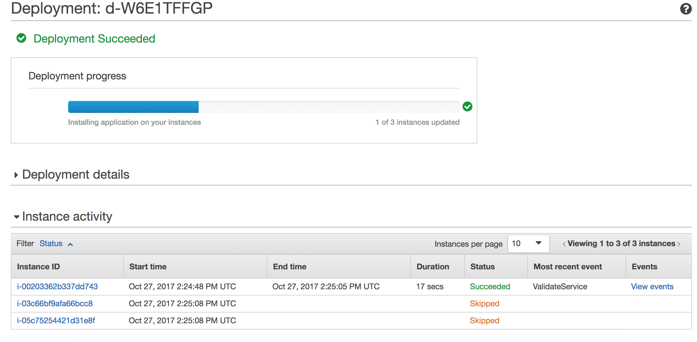

## AWS Codedeploy New Instance Sync Lambda

Python script to automatically sync instances via AWS CodeDeploy APIs

## License

This library is licensed under the Apache 2.0 License. 

# Deploying to a new instance with Amazon CodeDeploy, AWS Lambda and AWS Cloudwatch Rule

This architecture provides a set of instructions for deploying code to newly launched EC2 instances using [Amazon CodeDeploy ](https://aws.amazon.com/codedeploy/details/) with [AWS Lambda](https://aws.amazon.com/lambda/) and [AWS Cloudwatch Events](http://docs.aws.amazon.com/AmazonCloudWatch/latest/events/WhatIsCloudWatchEvents.html)

## PreRequisite:

You have an existing CodeDeploy application with more than 1 instance in the deployment group. Its also assumed that you have a CodeDeploy Service role already created. You have to update the EC2 instances with CodeDeployGroup and Application Tag

## Overview

There is a CloudWatch Events rule which triggers a lambda for every EC2 instance launch. Lambda parses the new instance information and extracts 3 tags – Name, CodeDeployDeploymentGroup and CodeDeployApplication. Then it adds the EC2 instance to the deployment group obtained from the instance tags. Once added, lambda queries codedeploy to retrieve last successful deployment. Finally, it creates a new deployment with updateOutdatedInstancesOnly flag, so only the new instance added to the deployment group is synchronized with the new code.

### Steps

You can launch this CloudFormation stack in the US East (N. Virginia) Region in your account:

  

### Test

Assumption:

1. You already have couple of instances - CodeDeployDemo and CodeDeployDemo2 as part of your deployment group. They have Name, CodeDeployApplication and CodeDeployDeploymentGroup Tags on them.
2. You have a successful deployment and have noted the deployment-id

Goal of the Test:

If a new instance with Name, CodeDeployApplication and CodeDeployDeploymentGroup tag gets introduced, it will be added to the respective deployment group. Finally the last successful deployment will be pushed to the new instance

### Test Results

New EC2 instance with the appropriate tags is launched

Lambda is triggered as evident from the Cloudwatch Logs:

`{[
"arn:aws:ec2:us-east-1:xxxxxxxxxxxxxxx:instance/i-00203362b337dd743"]
}`

Here it is looking up the last deployment id and gets the artifacts associated with that

`DepId is d-CSBCXR2GP`

Finally, its creates a new deployment to synch the latest instance:

`"{u'deploymentId': u'd-W6E1TFFGP', 'ResponseMetadata': {'RetryAttempts': 0, 'HTTPStatusCode': 200, 'RequestId': '73046797-bb22-11e7-ad7b-25693e030410', 'HTTPHeaders': {'x-amzn-requestid': '73046797-bb22-11e7-ad7b-25693e030410', 'content-length': '30', 'content-type': 'application/x-amz-json-1.1'}}}
"`

Post lambda run

New instance is synched with the latest deployment

